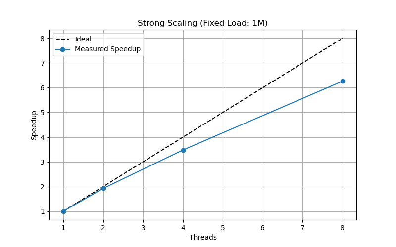
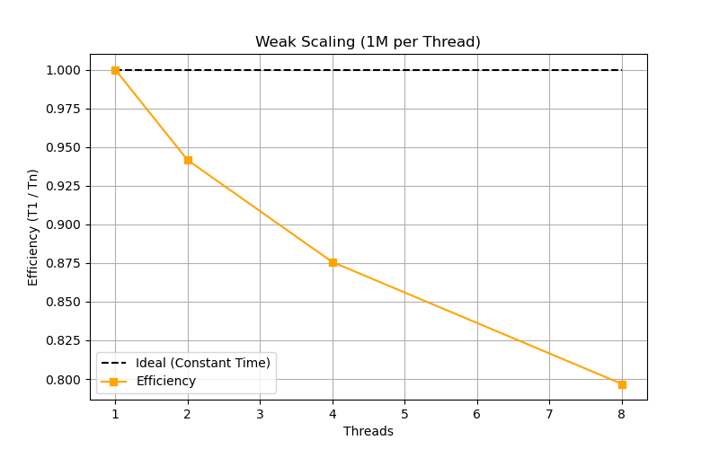
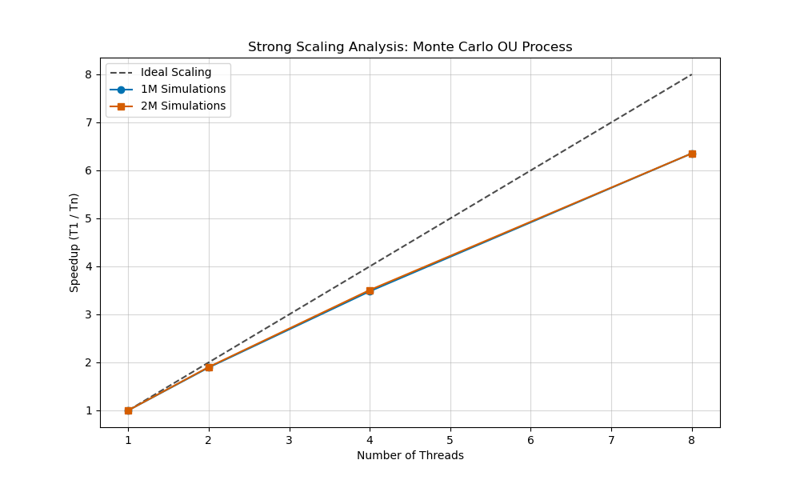

cat << 'EOF' > README.md
# Parallel Monte Carlo Simulation: Ornstein-Uhlenbeck Process

## 1. Technical Abstract
This project implements a high-performance parallel simulator for the **Ornstein-Uhlenbeck (OU)** process. By utilizing **OpenMP** for multi-threaded execution and **Euler-Maruyama** discretization, we achieve significant speedups for massive Monte Carlo ensembles. This repository serves as a study on parallel scaling limits, identifying the "Memory Wall" in stochastic simulations.

---

## 2. Mathematical Foundation

### The Ornstein-Uhlenbeck SDE
The process is defined by the following Stochastic Differential Equation (SDE):
$$dX_t = \theta (\mu - X_t)dt + \sigma dW_t$$
where $\theta$ is the mean reversion rate, $\mu$ is the long-term equilibrium, and $\sigma$ is volatility.

### Euler-Maruyama Discretization
To solve the SDE numerically, we discretize time as:
$$X_{n+1} = X_n + \theta (\mu - X_n)\Delta t + \sigma \sqrt{\Delta t} Z_n$$
Random noise $Z_n \sim \mathcal{N}(0,1)$ is generated using the **Box-Muller Transform**:
$$Z = \sqrt{-2 \ln U_1} \cdot \cos(2\pi U_2)$$

---

## 3. Performance Analysis & Results
Benchmarks were conducted on an 8-thread architecture using Ubuntu WSL.

### Strong Scaling (Fixed Load)
*Proving that increasing workload intensity (1M vs 2M) improves parallel efficiency by amortizing overhead.*

| Threads | 1M Time (s) | 1M Speedup | 2M Time (s) | 2M Speedup |
| :--- | :--- | :--- | :--- | :--- |
| 1 | 75.03 | 1.00x | 150.18 | 1.00x |
| 2 | 38.96 | 1.93x | 78.88 | 1.90x |
| 4 | 21.56 | 3.48x | 42.81 | 3.51x |
| 8 | 11.98 | 6.26x | 23.63 | 6.35x |

### Weak Scaling (1M per Thread)
*Identifying the Memory Wall: Execution time increased from 74.8s to 93.9s (25.5% loss).*

| Threads | Workload | Time (s) | Observations |
| :--- | :--- | :--- | :--- |
| 1 | 1,000,000 | 74.89 | Baseline |
| 8 | 8,000,000 | 93.99 | **Memory Bandwidth Saturation** |

---

## 4. Repository Structure & File Guide

- **src/**:
    - `parallel.f90`: Core engine utilizing `omp parallel do` and `reduction`.
    - `serial.f90`: Single-threaded baseline.
    - `benchmark.sh`: Automation script to collect data across thread counts.
    - `plot_results.py`: Visualization suite for Scaling analysis.
- **results/**:
    - **data/**: Contains `strong_scaling.csv` and `weak_scaling.csv`.
    - **plots/**: Contains `strong_scaling.png`, `weak_scaling.png`, and `scaling_comparison.png`.

---

## 5. Visualizations

---

## 6. How to Run
1. **Build:** `gfortran -fopenmp src/parallel.f90 -o src/ou_parallel`
2. **Benchmark:** `./src/benchmark.sh`
3. **Plot:** `python3 src/plot_results.py`

---

## Author
**Vishal**
Mechanical Engineering, IIT
Founder, Sirius Corp
EOF
